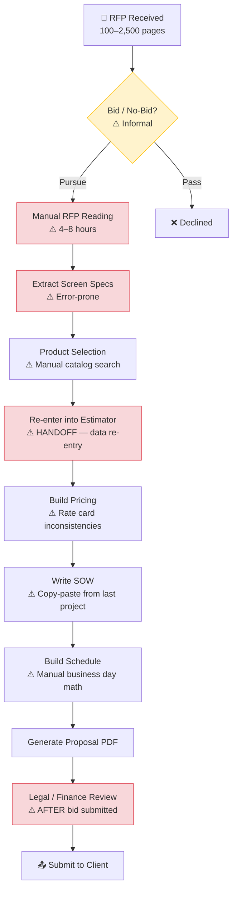
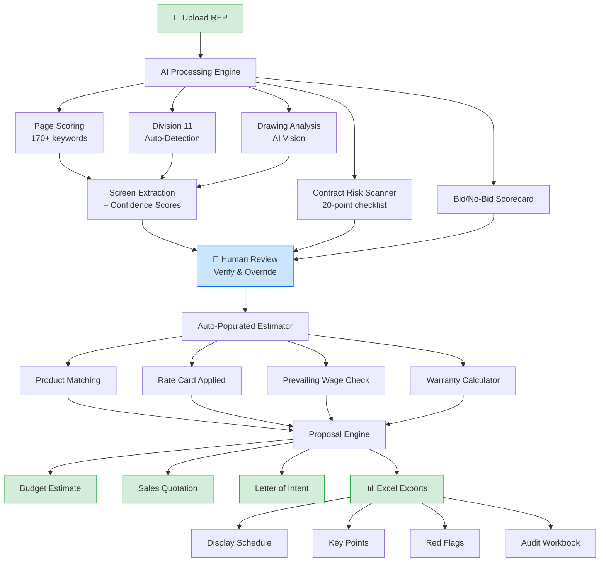

# ANC Sports Enterprises — Business Workflow Map

> Use this document to create a visual diagram (Mermaid, Figma, Lucidchart, draw.io, etc.)
> for inclusion in the Phase II proposal. The structure below maps ANC's end-to-end
> deal lifecycle from RFP receipt to project closeout, with pain points and automation
> opportunities marked at each stage.

---

## 1. Deal Lifecycle — High Level

```
RFP Received → Bid/No-Bid Decision → RFP Analysis → Estimation → Proposal Generation → Client Review → Contract → Execution → Closeout
```

---

## 2. Detailed Workflow Stages

### STAGE 1: RFP INTAKE

```
┌─────────────────────────────────────────────────────────┐
│  RFP INTAKE                                             │
│                                                         │
│  Input: PDF document (100–2,500+ pages)                 │
│                                                         │
│  Current Process (Manual):                              │
│  ┌───────────────────────────────────────┐              │
│  │ 1. Receive RFP via email/portal       │              │
│  │ 2. Skim document to assess relevance  │              │
│  │ 3. Identify LED/AV scope sections     │              │
│  │ 4. Forward to estimating team         │              │
│  └───────────────────────────────────────┘              │
│                                                         │
│  ⚠ Pain Points:                                        │
│  • 2,000-page docs — no one reads the whole thing       │
│  • LED scope buried in Division 11 (Section 11 06 60)   │
│  • Display specs on drawings, not in text               │
│  • No formal go/no-go before investing hours            │
│                                                         │
│  🟢 Automation:                                         │
│  • AI page scoring (170+ keywords)                      │
│  • Division 11 auto-detection                           │
│  • Bid/No-Bid scorecard                                 │
│  • Drawing analysis (AI vision)                         │
└─────────────────────────────────────────────────────────┘
```

### STAGE 2: RFP ANALYSIS & EXTRACTION

```
┌─────────────────────────────────────────────────────────┐
│  RFP ANALYSIS                                           │
│                                                         │
│  Current Process (Manual):                              │
│  ┌───────────────────────────────────────┐              │
│  │ 1. Read Division 11 sections          │              │
│  │ 2. Find every display mentioned       │              │
│  │ 3. Extract specs per screen:          │              │
│  │    - Name, location, dimensions       │              │
│  │    - Pixel pitch, resolution          │              │
│  │    - Environment (indoor/outdoor)     │              │
│  │    - Brightness, power, weight        │              │
│  │    - Quantity                          │              │
│  │ 4. Note deadlines & compliance reqs   │              │
│  │ 5. Flag red flags & unusual terms     │              │
│  │ 6. Compile into notes/spreadsheet     │              │
│  └───────────────────────────────────────┘              │
│                                                         │
│  ⚠ Pain Points:                                        │
│  • 4–8 hours per RFP for manual extraction              │
│  • Screens on drawings get missed                       │
│  • Specs scattered across Exhibit G, Form 1a/1b,        │
│    Display Schedule, architectural drawings              │
│  • No confidence scoring — estimator trusts or verifies │
│    everything manually                                  │
│  • Addendums change specs — easy to miss updates        │
│                                                         │
│  🟢 Automation:                                         │
│  • AI screen extraction (text + vision)                 │
│  • Confidence scoring per field                         │
│  • Key point extraction (deadlines, scope, compliance)  │
│  • Red flag detection                                   │
│  • Addendum diff tracking                               │
└─────────────────────────────────────────────────────────┘
```

### STAGE 3: PRODUCT SELECTION

```
┌─────────────────────────────────────────────────────────┐
│  PRODUCT SELECTION                                      │
│                                                         │
│  Current Process (Manual):                              │
│  ┌───────────────────────────────────────┐              │
│  │ 1. Take extracted specs per screen    │              │
│  │ 2. Search product catalog for match:  │              │
│  │    - Pixel pitch (2.5mm, 4mm, 10mm)   │              │
│  │    - Environment (indoor/outdoor)     │              │
│  │    - Brightness requirements          │              │
│  │ 3. Determine cabinet layout:          │              │
│  │    - Cabinet dimensions (960×960mm)   │              │
│  │    - Panels wide × panels high        │              │
│  │    - Handle remainder panels          │              │
│  │ 4. Calculate per-screen:              │              │
│  │    - Active area (m²)                 │              │
│  │    - Total weight (area × density)    │              │
│  │    - Max/avg power (area × density)   │              │
│  │    - Hardware cost                    │              │
│  │ 5. Select alternates (upgrade/deduct) │              │
│  └───────────────────────────────────────┘              │
│                                                         │
│  ⚠ Pain Points:                                        │
│  • Manual catalog lookup per screen (7–12 per project)  │
│  • Cabinet topology math is error-prone                 │
│  • Mixed-cabinet layouts (remainder panels) need solver │
│  • Alternate pricing (upgrade to finer pitch) manual    │
│                                                         │
│  🟢 Automation:                                         │
│  • Auto product matching by pitch/environment           │
│  • Cabinet topology solver (uniform + mixed)            │
│  • Exhibit G auto-calculation (area × density)          │
│  • Alternate extraction from RFP text                   │
└─────────────────────────────────────────────────────────┘
```

### STAGE 4: ESTIMATION & PRICING

```
┌─────────────────────────────────────────────────────────┐
│  ESTIMATION & PRICING                                   │
│                                                         │
│  Current Process (Manual/Semi-Manual):                  │
│  ┌───────────────────────────────────────┐              │
│  │ 1. Re-enter screen specs into         │              │
│  │    pricing spreadsheet                │  ← HANDOFF  │
│  │ 2. Apply rate card:                   │              │
│  │    - LED hardware: 30% margin         │              │
│  │    - Services: 20% margin (>100sqft)  │              │
│  │              30% margin (<100sqft)    │              │
│  │    - LiveSync/CMS: 35% margin         │              │
│  │ 3. Calculate install costs:           │              │
│  │    - Steel fabrication: $25–75/lb     │              │
│  │      (by complexity tier)             │              │
│  │    - LED install: $75–145/sqft        │              │
│  │    - Heavy equipment: $30/lb          │              │
│  │    - PM/GC/Travel: $5/lb             │              │
│  │ 4. Add bond (1.5%) + tax (8.875%)    │              │
│  │ 5. Add spare parts (5%)              │              │
│  │ 6. Calculate PM fee + Eng fee         │              │
│  │    (zone-multiplied)                  │              │
│  │ 7. Build warranty pricing:            │              │
│  │    - Years 1–3: base                  │              │
│  │    - Years 4–10: +10%/year compound   │              │
│  │ 8. Check for prevailing wage impact   │              │
│  └───────────────────────────────────────┘              │
│                                                         │
│  ⚠ Pain Points:                                        │
│  • Data re-entry from extraction → estimator            │
│  • Rate card values scattered / inconsistent            │
│  • Complexity tier selection is subjective              │
│  • Prevailing wage missed = margin destroyed            │
│  • Warranty escalation math done manually               │
│  • No audit trail — hard to verify how price was built  │
│                                                         │
│  🟢 Automation:                                         │
│  • RFP-to-Estimator pipeline (zero re-entry)            │
│  • Rate card loaded from DB with admin UI               │
│  • Prevailing wage auto-detection + adjustment          │
│  • Warranty escalation calculator                       │
│  • Audit Excel with formula transparency                │
└─────────────────────────────────────────────────────────┘
```

### STAGE 5: PROPOSAL GENERATION

```
┌─────────────────────────────────────────────────────────┐
│  PROPOSAL GENERATION                                    │
│                                                         │
│  Three Document Types:                                  │
│  ┌─────────┐  ┌──────────────┐  ┌───────────────────┐  │
│  │ BUDGET  │  │  PROPOSAL    │  │ LETTER OF INTENT  │  │
│  │ ESTIMATE│  │  (Sales      │  │ (Binding, with    │  │
│  │ (Early  │  │   Quotation) │  │  signatures,      │  │
│  │  stage, │  │              │  │  payment terms,    │  │
│  │  no     │  │              │  │  legal intro,      │  │
│  │  sigs)  │  │              │  │  responsibility    │  │
│  │         │  │              │  │  matrix)           │  │
│  └─────────┘  └──────────────┘  └───────────────────┘  │
│                                                         │
│  Each Contains:                                         │
│  ┌───────────────────────────────────────┐              │
│  │ • Project summary                     │              │
│  │ • Display schedule (per-screen specs) │              │
│  │ • Pricing breakdown                   │              │
│  │ • Scope of Work (8 sections)          │              │
│  │ • Project schedule                    │              │
│  │ • Alternates (upgrades/deducts)       │              │
│  │ • Warranty terms                      │              │
│  └───────────────────────────────────────┘              │
│                                                         │
│  ⚠ Pain Points:                                        │
│  • SOW written from scratch each time                   │
│  • Schedule built manually (business day math)          │
│  • Three doc types share 80% content but managed        │
│    separately                                           │
│  • PDF output must match ANC brand exactly              │
│                                                         │
│  🟢 Automation:                                         │
│  • SOW generator (8 toggleable sections)                │
│  • Schedule generator (NTP → closeout)                  │
│  • Three-mode document toggle (Budget/Proposal/LOI)     │
│  • Mirror Mode (Excel → PDF exact match)                │
└─────────────────────────────────────────────────────────┘
```

### STAGE 6: CONTRACT REVIEW

```
┌─────────────────────────────────────────────────────────┐
│  CONTRACT REVIEW                                        │
│                                                         │
│  Current Process (Manual):                              │
│  ┌───────────────────────────────────────┐              │
│  │ 1. Legal reviews full RFP contract    │              │
│  │ 2. Identify risk clauses              │              │
│  │ 3. Negotiate terms                    │              │
│  │ 4. Finalize and sign                  │              │
│  └───────────────────────────────────────┘              │
│                                                         │
│  ⚠ Pain Points:                                        │
│  • Legal review happens AFTER bid submitted             │
│  • 20 categories of risk buried in boilerplate          │
│  • Uncapped LDs, high bonds, missing force majeure      │
│    discovered too late                                  │
│                                                         │
│  🟢 Automation:                                         │
│  • 20-point contract risk scanner runs at INTAKE        │
│  • Risk score (0–100) before any work begins            │
│  • Specific recommendations per flagged clause          │
└─────────────────────────────────────────────────────────┘
```

### STAGE 7: EXECUTION

```
┌─────────────────────────────────────────────────────────┐
│  EXECUTION                                              │
│                                                         │
│  Sequence (all business days):                          │
│  ┌───────────────────────────────────────┐              │
│  │ NTP (Day 1)                           │              │
│  │  ├─ Design & Engineering (38 days)    │              │
│  │  ├─ Secondary Structural (30 days) ─┐ │              │
│  │  ├─ Electrical Design (30 days) ────┤ │  PARALLEL    │
│  │  ├─ Control Room Design (30 days) ──┘ │              │
│  │  ├─ LED Manufacturing (45 days) ──────│─ PARALLEL    │
│  │  │                                    │              │
│  │  ├─ Prep Submittals (3 days)          │              │
│  │  ├─ Owner Review (5 days)             │              │
│  │  │                                    │              │
│  │  ├─ Ocean Freight (23 days)           │              │
│  │  ├─ Ground Shipping (4 days)          │              │
│  │  ├─ Integration & Testing (18 days) ─┐│  PARALLEL    │
│  │  ├─ Control Programming (10 days) ───┘│              │
│  │  │                                    │              │
│  │  ├─ PER LOCATION INSTALL:             │              │
│  │  │  ├─ Mobilization (1–2 days)        │              │
│  │  │  ├─ Demolition (1–4 days)          │              │
│  │  │  ├─ Secondary Steel (3 days)*      │              │
│  │  │  ├─ LED Panel Install (2–17 days)  │              │
│  │  │  ├─ Infrastructure (3–9 days) ──┐  │  PARALLEL    │
│  │  │  ├─ Low Voltage (3–9 days) ─────┘  │  (offset 2)  │
│  │  │  └─ Finishes & Trim (1–2 days)     │              │
│  │  │                                    │              │
│  │  └─ Commissioning & Handoff           │              │
│  └───────────────────────────────────────┘              │
│  * Secondary Steel only for complex_hanging installs    │
│                                                         │
│  Total: ~45 business days (9 work weeks) typical        │
│                                                         │
│  ⚠ Pain Points:                                        │
│  • Schedule built manually each time                    │
│  • Business day math errors                             │
│  • Parallel task offsets forgotten                      │
│  • Multi-venue phasing not tracked centrally            │
│                                                         │
│  🟢 Automation:                                         │
│  • Auto schedule from NTP date                          │
│  • Business day calculator (validated)                  │
│  • Per-location install scaling (small/medium/large)    │
│  • Multi-venue phase tracking                           │
└─────────────────────────────────────────────────────────┘
```

---

## 3. Handoff Map — Where Data Moves Between People

```
                    ┌──────────┐
                    │ RFP PDF  │
                    └────┬─────┘
                         │
                         ▼
              ┌─────────────────────┐
              │  BUSINESS DEV /     │
              │  SALES              │
              │  "Is this worth     │
              │   pursuing?"        │
              └──────────┬──────────┘
                         │
              ⚠ HANDOFF 1: Forward RFP + verbal notes
                         │
                         ▼
              ┌─────────────────────┐
              │  RFP READER /       │
              │  ESTIMATING LEAD    │
              │  "What displays     │
              │   are in here?"     │
              └──────────┬──────────┘
                         │
              ⚠ HANDOFF 2: Spreadsheet/notes with extracted specs
                         │
                         ▼
              ┌─────────────────────┐
              │  ESTIMATOR          │
              │  "What does this    │
              │   cost?"            │
              │  Re-enters specs    │
              │  into pricing tool  │
              └──────────┬──────────┘
                         │
              ⚠ HANDOFF 3: Pricing spreadsheet
                         │
                         ▼
              ┌─────────────────────┐
              │  PROPOSAL WRITER    │
              │  "Package it for    │
              │   the client"       │
              │  Writes SOW,        │
              │  builds schedule,   │
              │  formats PDF        │
              └──────────┬──────────┘
                         │
              ⚠ HANDOFF 4: Draft proposal for review
                         │
                         ▼
              ┌─────────────────────┐
              │  FINANCE / LEGAL    │
              │  "Check the         │
              │   numbers and       │
              │   contract terms"   │
              └──────────┬──────────┘
                         │
                         ▼
              ┌─────────────────────┐
              │  CLIENT SUBMISSION  │
              └─────────────────────┘
```

**Every handoff is a risk point:**
- Data gets re-entered (errors)
- Context gets lost (verbal notes)
- Time gets wasted (waiting for the next person)
- Things get missed (addendums, spec changes, contract risks)

---

## 4. The Automated Workflow — What Changes

```
                    ┌──────────┐
                    │ RFP PDF  │
                    └────┬─────┘
                         │
                         ▼
              ┌─────────────────────┐
              │  UPLOAD             │
              │  (one click)        │
              └──────────┬──────────┘
                         │
            ┌────────────┼────────────┐
            ▼            ▼            ▼
   ┌──────────────┐ ┌──────────┐ ┌──────────────┐
   │ AI EXTRACTION│ │ CONTRACT │ │ BID/NO-BID   │
   │              │ │ RISK     │ │ SCORECARD    │
   │ • Screens    │ │ SCANNER  │ │              │
   │ • Specs      │ │          │ │ Go/Caution/  │
   │ • Key points │ │ 20-point │ │ No-Go        │
   │ • Drawings   │ │ checklist│ │              │
   │ • Alternates │ │ Risk: 0–100            │  │
   └──────┬───────┘ └────┬─────┘ └──────┬───────┘
          │              │              │
          └──────────────┼──────────────┘
                         │
                         ▼
              ┌─────────────────────┐
              │  REVIEW & CONFIRM   │
              │  (human in the loop)│
              │                     │
              │  • Verify screens   │
              │  • Check confidence │
              │  • Override if needed│
              └──────────┬──────────┘
                         │
                         ▼
              ┌─────────────────────┐
              │  AUTO-POPULATED     │
              │  ESTIMATOR          │
              │                     │
              │  • Screens pre-filled│
              │  • Products matched │
              │  • Rate card applied│
              │  • Prevailing wage  │
              │    auto-detected    │
              │  • Warranty calc'd  │
              └──────────┬──────────┘
                         │
                         ▼
              ┌─────────────────────┐
              │  PROPOSAL OUTPUT    │
              │                     │
              │  • Budget / Proposal│
              │    / LOI (one click)│
              │  • SOW generated    │
              │  • Schedule built   │
              │  • Audit Excel      │
              │    with full trace  │
              └──────────┬──────────┘
                         │
                         ▼
              ┌─────────────────────┐
              │  EXCEL EXPORTS      │
              │                     │
              │  • Display Schedule │
              │  • Key Points       │
              │  • Red Flags        │
              │  • Audit Workbook   │
              │  • Risk Report      │
              └─────────────────────┘
```

**What's eliminated:**
- ~~Handoff 1~~: Bid/No-Bid scorecard replaces verbal "should we pursue this?"
- ~~Handoff 2~~: AI extraction replaces manual spec reading
- ~~Handoff 3~~: Pipeline pushes specs directly to estimator — no re-entry
- ~~Handoff 4~~: Proposal generated from same data — no repackaging

---

## 5. Time Savings Estimate

| Stage | Current (Manual) | Automated | Savings |
|-------|-----------------|-----------|---------|
| Bid/No-Bid decision | 2–4 hours (informal) | 5 minutes | ~3 hours |
| RFP reading & extraction | 4–8 hours | 10 minutes + 30 min review | ~6 hours |
| Product selection | 2–4 hours | 5 minutes + confirmation | ~3 hours |
| Data re-entry into estimator | 1–2 hours | 0 (pipeline) | ~1.5 hours |
| Contract risk review | 2–4 hours (if done at all) | 2 minutes | ~3 hours |
| SOW writing | 2–3 hours | 5 minutes + editing | ~2.5 hours |
| Schedule building | 1–2 hours | 1 minute | ~1.5 hours |
| **Total per RFP** | **14–27 hours** | **~1.5 hours** | **~20 hours** |

At 50+ RFPs per year: **~1,000 hours saved annually**

---

## 6. Margin Protection Points

These are the specific places where money is lost if the process isn't automated:

| Risk | How It Happens | $ Impact |
|------|---------------|----------|
| **Missed screen** | Display on drawing, not in text schedule | $50K–$200K per screen |
| **Wrong pixel pitch** | Manual re-entry error (2.5mm vs 4mm) | $40K+ cost difference |
| **Prevailing wage missed** | Buried in 2,000 pages of boilerplate | 40–80% labor cost increase |
| **Uncapped LDs** | Legal clause not caught before bid | Unlimited exposure |
| **Bond rate too high** | 5%+ bond not flagged (ANC standard: 1.5%) | $30K–$75K on a $1.5M project |
| **Addendum missed** | Spec change in Addendum #3 not applied | Bid priced on wrong specs |
| **Warranty underpriced** | 10% annual escalation calculated wrong | $50K–$100K over 10 years |
| **Retainage >10%** | Cash flow impact not priced in | Working capital strain |

---

## 7. Diagram Suggestions

For the actual visual diagram, I recommend creating **three visuals**:

### Visual 1: "Before & After" Side-by-Side
- Left: Current workflow (7 stages, 4 handoffs, manual)
- Right: Automated workflow (upload → review → output)
- Use red/yellow markers on the left for pain points
- Use green markers on the right for automation

### Visual 2: Data Flow Diagram
- Show the RFP PDF at the top
- Fan out into parallel AI processes (extraction, risk scan, bid scorecard)
- Converge into the estimator
- Output as three document types + Excel exports
- Highlight "zero re-entry" and "single source of truth"

### Visual 3: Margin Protection Map
- Show the 8 risk points from Section 6 above
- Each one with a dollar figure
- Draw a shield/gate at each point showing the automated check
- Bottom line: "Total margin exposure eliminated per project"

---

## 8. Mermaid.js Diagram Code (Ready to Render)

### Current Workflow (Before)



### Automated Workflow (After)



### Margin Protection Flow

```mermaid
flowchart LR
    RFP[📄 RFP] --> S1[🛡 Page Scoring<br/>No missed sections]
    S1 --> S2[🛡 Screen Extraction<br/>No missed displays]
    S2 --> S3[🛡 Product Matching<br/>No wrong specs]
    S3 --> S4[🛡 Risk Scanner<br/>No hidden clauses]
    S4 --> S5[🛡 Prevailing Wage<br/>No labor surprises]
    S5 --> S6[🛡 Warranty Calc<br/>No underpricing]
    S6 --> S7[🛡 Audit Trail<br/>Every number traceable]
    S7 --> BID[✅ Protected Bid]

    style S1 fill:#d4edda,stroke:#28a745
    style S2 fill:#d4edda,stroke:#28a745
    style S3 fill:#d4edda,stroke:#28a745
    style S4 fill:#d4edda,stroke:#28a745
    style S5 fill:#d4edda,stroke:#28a745
    style S6 fill:#d4edda,stroke:#28a745
    style S7 fill:#d4edda,stroke:#28a745
    style BID fill:#28a745,color:#fff
```



---

## 9. Key Numbers for the Diagram

Use these in callout boxes or annotations:

- **170+** keywords in page scoring engine
- **20** contract risk checks
- **5** risk dimensions in bid scorecard
- **8** SOW template sections
- **12** pre-install schedule phases
- **7** per-location install tasks
- **3** document modes (Budget / Proposal / LOI)
- **4** install complexity tiers (simple → heavy)
- **3** margin categories (LED 30%, services 20–30%, LiveSync 35%)
- **~20 hours** saved per RFP
- **~1,000 hours** saved annually (50+ RFPs)
